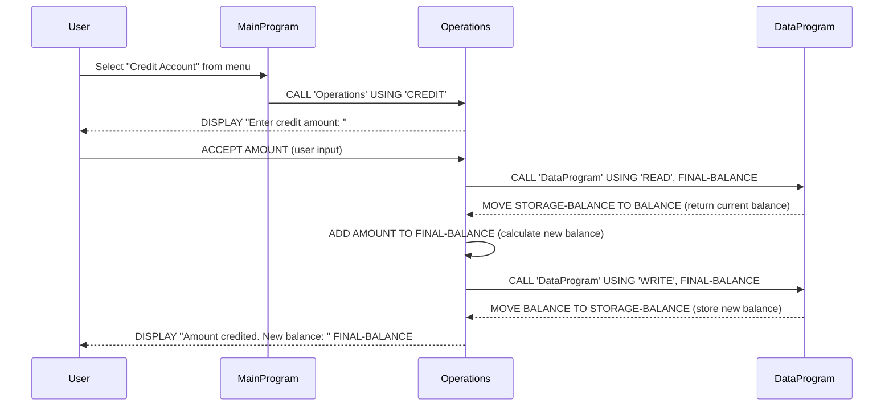

# COBOL Student Account Management System

This project contains a COBOL-based system for managing student financial accounts. The system allows students to view their account balance, credit funds to their account, and debit funds from their account with appropriate business rules.

## COBOL Files Overview

### data.cob
**Purpose:** Handles persistent data storage for student account balances.

**Key Functions:**
- Stores the current account balance in working storage
- Provides read/write operations for balance data
- Acts as a data layer for the account management system

**Technical Details:**
- Uses `STORAGE-BALANCE` variable to maintain balance state
- Supports 'READ' and 'WRITE' operations via linkage section
- Initial balance is set to $1000.00

### main.cob
**Purpose:** Main entry point and user interface for the student account management system.

**Key Functions:**
- Displays a menu-driven interface for account operations
- Handles user input and navigation
- Calls appropriate operations based on user selection

**Menu Options:**
1. View Balance - Displays current account balance
2. Credit Account - Adds funds to the account
3. Debit Account - Subtracts funds from the account (with validation)
4. Exit - Terminates the program

### operations.cob
**Purpose:** Implements the core business logic for account operations.

**Key Functions:**
- `TOTAL` operation: Retrieves and displays current balance
- `CREDIT` operation: Adds specified amount to account balance
- `DEBIT` operation: Subtracts specified amount from account balance (with validation)

## Business Rules for Student Accounts

### Account Balance Management
- **Initial Balance:** All student accounts start with a balance of $1000.00
- **Credit Operations:** Students can add any positive amount to their account balance
- **Debit Operations:** Students can only debit amounts that do not exceed their current balance
  - If debit amount > current balance, the transaction is rejected with "Insufficient funds" message
- **Balance Display:** Current balance is shown with dollar formatting

### Transaction Validation
- Debit transactions require sufficient funds check before processing
- All monetary values are handled with 6 digits before decimal and 2 after (PIC 9(6)V99)
- Invalid menu choices are handled gracefully with error messages

### Data Persistence
- Account balance is maintained in memory through the data.cob program
- Balance state persists during program execution but resets on program restart

## System Architecture

The system follows a modular design with three main components:
1. **Main Program (main.cob):** User interface and program flow control
2. **Operations Module (operations.cob):** Business logic and transaction processing
3. **Data Module (data.cob):** Data storage and retrieval operations

This separation allows for maintainable code and clear separation of concerns in the COBOL implementation.

## Sequence Diagram

The following sequence diagram illustrates the data flow for a credit operation in the student account management system:

### Data Flow Explanation

1. **User Interaction**: User selects an operation from the main menu
2. **Program Control**: MainProgram routes the request to the appropriate operation
3. **Business Logic**: Operations module handles the transaction logic, including user input for amounts
4. **Data Access**: DataProgram manages reading from and writing to the persistent balance storage
5. **Response**: Results are displayed back to the user

**Note**: The debit operation follows a similar flow but includes an additional validation step to check if the current balance is sufficient before processing the transaction. The view balance operation is simpler, requiring only a read operation from the data layer.